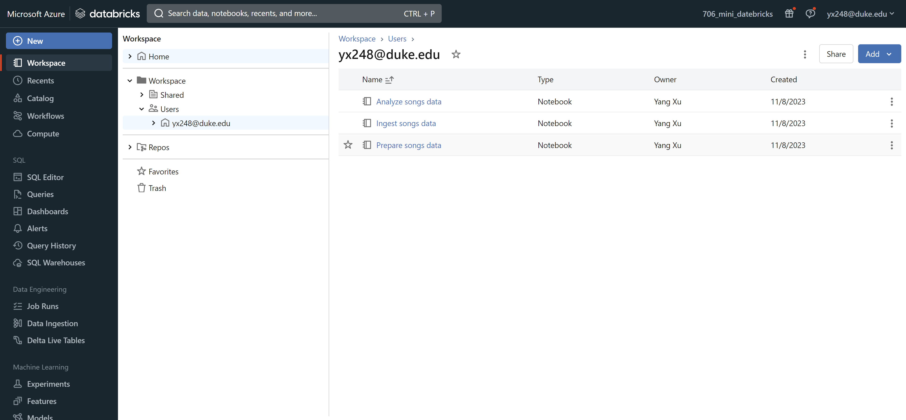
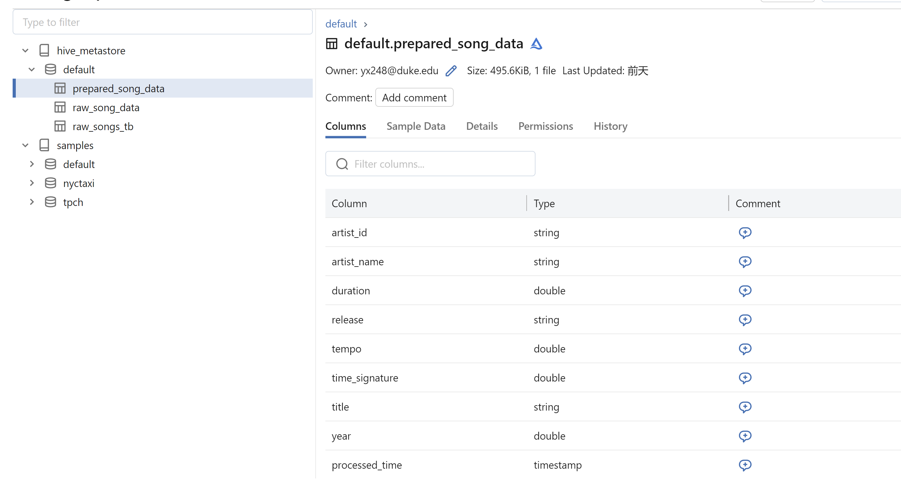
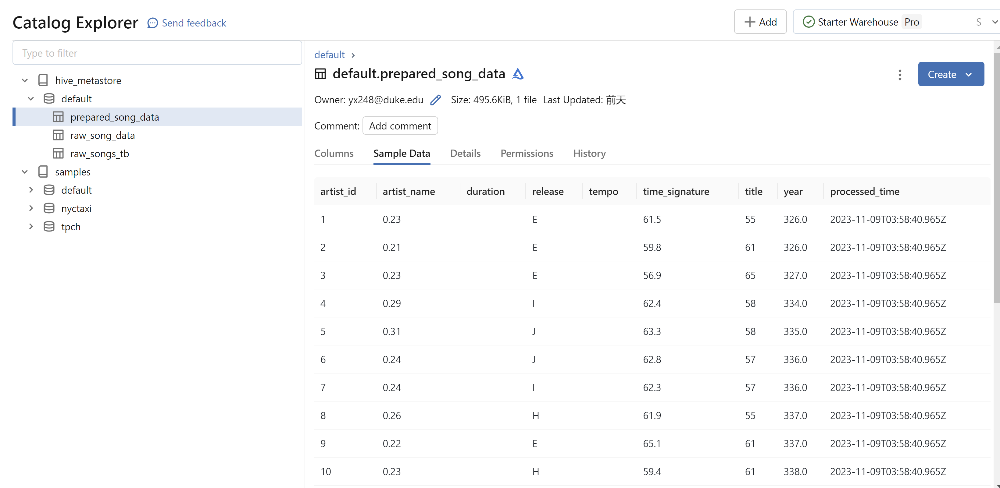
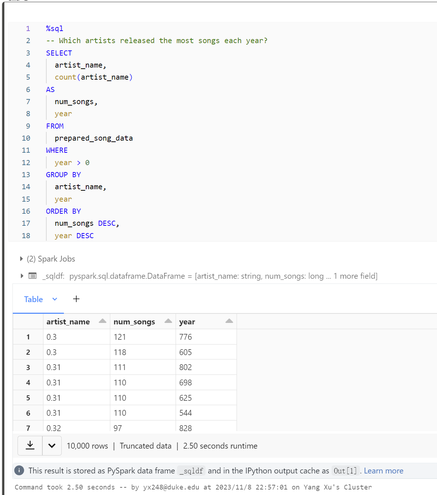
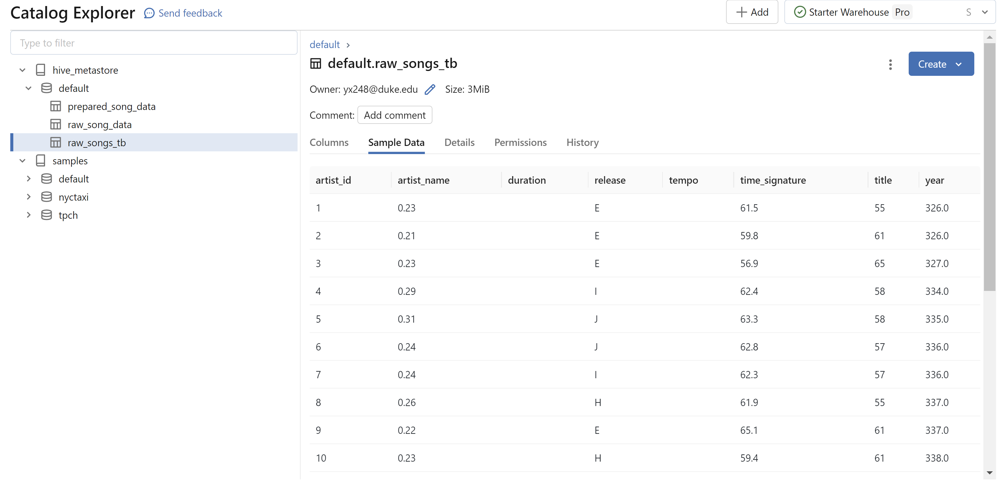
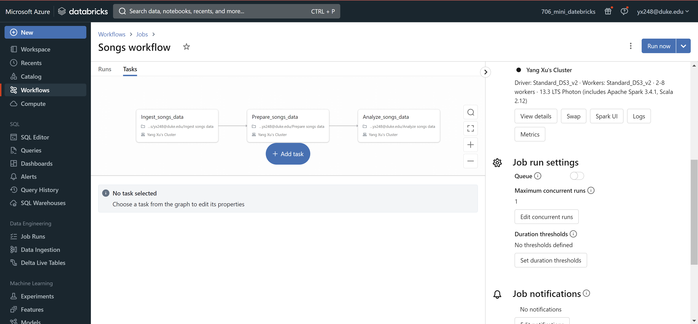
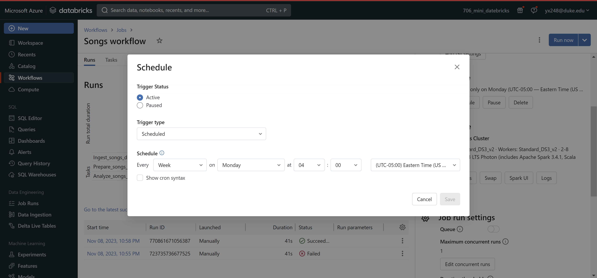

# IDS706_MiniProj11_YangXu

## Project Overview

This project demonstrates the creation of a data pipeline using Azure Databricks. The pipeline processes and analyzes a dataset of songs, showcasing the end-to-end capabilities of Databricks for data engineering tasks.

## Requirements

- Databricks Environment: Access to Azure Databricks workspace.
- Objective: Construct a data pipeline with at least one data source and one data sink.

## Pipeline Steps and Screenshots

### Data Ingestion
Here we ingest the raw song data from a CSV file into the Databricks environment.

### Data Transformation
This step involves transforming the raw song data to prepare it for analysis.
- Data Schema Definition for `prepared_song_data`

- Sample Transformed Data in `prepared_song_data`

### Data Analysis
Analysis is performed on the prepared data to extract insights.
- SQL Query for Analysis

- Analysis Result

### Data Storage
The notebooks used for ingesting and processing data are stored within the Databricks workspace.

### Workflow Automation
A scheduled workflow is set up to automate the data pipeline.
- Workflow Overview

- Workflow Schedule

## How to Run the Project

Follow these steps to recreate the pipeline in your Databricks environment:
1. Set up a Databricks cluster.
2. Import the notebooks into your workspace.
3. Run the notebooks in the following order: ingestion, transformation, analysis.
4. Verify the output at each stage for correctness.

## Deliverables

- Databricks Notebooks: Scripts for each step of the pipeline.
- Documentation: This README including the project overview and screenshots demonstrating the pipeline's functionality.
